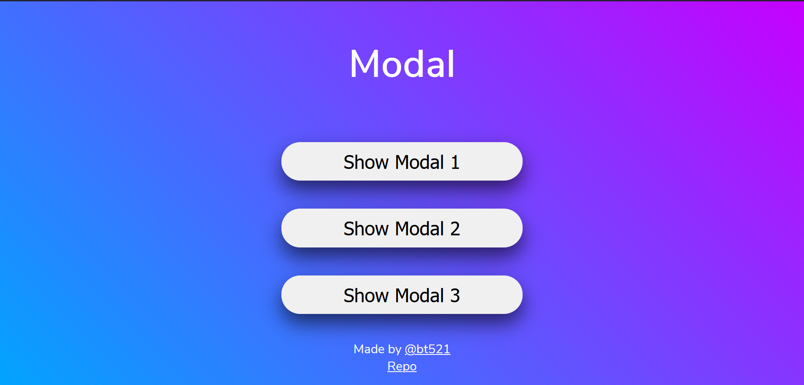

# JS_Modal

This is an example of a modal using javascript
When any of the three buttons are clicked, the modal pops up

**[link](https://bt521.github.io/js_modal/)**

## Features

- The user can click outside the modal or hit the escape key to exit the modal.
